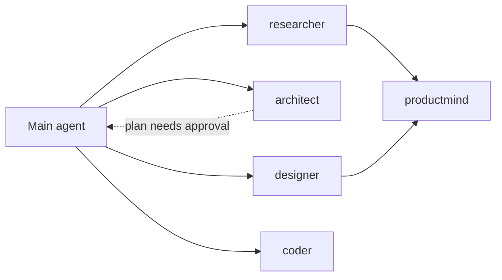

# Cursor Subagent Configuration

Five specialized subagents live in `.cursor/agents/`. Each file has YAML frontmatter (`name`, `description`, `model`, `readonly`) followed by its system prompt. Cursor reads `description` to decide when to delegate, and you can also call any of them explicitly with `/name` (e.g. `/architect plan the sync layer`).

The main agent acts as the **orchestrator**. Its instructions and the project guardrails live in the root `AGENTS.md`, which Cursor applies to the main agent automatically. It uses whichever model you pick in the chat, and it builds the app slice by slice, calling the subagents below.

| Agent | File | Access | Model | Called by |
| --- | --- | --- | --- | --- |
| orchestrator | `AGENTS.md` | write | chat model picker | you |
| researcher | `.cursor/agents/researcher.md` | read-only | `gpt-5.6-sol` | main agent |
| productmind | `.cursor/agents/productmind.md` | read-only | `claude-opus-5` | `designer`, `researcher` only |
| designer | `.cursor/agents/designer.md` | write | `claude-opus-5-5` | main agent |
| architect | `.cursor/agents/architect.md` | read-only | `claude-opus-5-5[effort=high]` | main agent |
| coder | `.cursor/agents/coder.md` | write | `claude-opus-5-5` | main agent |

## Workflow

Typical flow for a feature: `researcher` (what exists) -> `architect` (plan, user approves) -> `designer` (UI and workflows) and `coder` (logic, APIs, tests) -> CI verifies.

### About the "only callable by Designer / Research" rule

Cursor has no frontmatter field that restricts who can call a subagent. The rule is enforced two ways:

1. `productmind`'s `description` tells the main agent not to call it directly, and the `researcher` and `designer` prompts tell those agents when to call it.
2. Cursor's nesting limit: the main agent and its direct subagents can launch subagents, but a subagent launched by another subagent can't launch more. When `designer` or `researcher` calls `productmind`, it stays a leaf.

If `productmind` is called outside that flow anyway, its prompt tells it to say so at the top of its output.

## Frontmatter fields used

| Field | Values used | Why |
| --- | --- | --- |
| `name` | lowercase-hyphen | Identifier and `/name` command. |
| `description` | role + when to use + "use proactively" where appropriate | Drives automatic delegation. |
| `model` | specific model IDs (see below) | Pins each role to the best-fit model instead of inheriting the parent's. |
| `readonly` | `true` for researcher, productmind, architect | Research and planning roles can't edit files or run state-changing commands. Designer and coder keep the default write access. |
| `is_background` | not set (defaults to `false`) | Every role's output feeds the next step, so the parent waits for it. Set `true` on `researcher` if you want long research to run in parallel. |

## Model selection research

Benchmarks were chosen to match each role. Sources are public leaderboards and vendor system cards, checked Sep 2026. Harnesses differ between sources, so small gaps are noise. Only models currently offered in Cursor were considered.

### Coder: repository-level coding (SWE-bench Pro)

| Model | Score | Available in Cursor |
| --- | --- | --- |
| **Claude Opus 5.5** | **89.9%** | yes (`claude-opus-5-5`) |
| Claude Fable 5.1 | 81.2% | not listed |
| Claude Opus 5 | 79.2% | yes |
| GPT-5.6 Sol | 64.6% | yes |
| Composer 2.5 | ~Opus 4.7 level (Cursor-reported) | yes, cheapest |

Pick: **Claude Opus 5.5**. It leads the next-best model in Cursor by more than 10 points and costs less than Opus 5 ($4/$20 per 1M tokens). Budget alternative: `composer-2.5` for routine, well-specified tasks.

Sources: [llm-stats SWE-bench Pro](https://llm-stats.com/benchmarks/swe-bench-pro), [BenchLM SWE-bench Pro](https://benchlm.ai/benchmarks/swe-bench-pro), [Cursor Models & Pricing](https://cursor.com/docs/models-and-pricing)

### Designer: front-end and UI quality (LMArena WebDev, human preference)

| Model | Elo | Available in Cursor |
| --- | --- | --- |
| **Claude Opus 5.5 (max)** | **1820** | yes |
| GPT-6 Astra (max) | 1792 | no |
| Claude Fable 5.1 | 1758 | not listed |
| Claude Opus 5 (max) | 1687 | yes |
| GPT-5.6 Sol (xhigh) | 1617 | yes |

Pick: **Claude Opus 5.5**. It ranks #1 on human-judged web UI quality, and it's also the best coder, so the designer's code holds up. Alternative: `claude-opus-5`.

Sources: [Arena WebDev leaderboard](https://arena.ai/leaderboard/code/webdev/overall), [Arena WebDev by lab](https://arena.ai/leaderboard/code?rankBy=labs)

### Architect: deep reasoning and planning

Pick: **Claude Opus 5.5 with `effort=high`**. It leads real-repo reasoning (SWE-bench Pro) and Terminal-Bench, which fits planning that has to line up with the actual codebase. High effort is worth the extra cost here because the architect runs rarely and its mistakes are expensive. Alternative: `gpt-5.6-sol`, a strong second opinion from a different model family.

### Researcher: finding hard facts on the web (BrowseComp)

| Model | Score | Available in Cursor |
| --- | --- | --- |
| Atria Dawn Preview | 92.5% | no |
| **GPT-5.6 Sol** | **90.4% single / 92.2% multi-agent** | yes (`gpt-5.6-sol`) |
| GPT-6 Astra | 91.5% | no |
| Kimi K3 | 91.2% | no |
| Claude Opus 5 | 90.8% | yes |

Pick: **GPT-5.6 Sol**. It's the best Cursor-available model at persistent, multi-page fact-finding, which is what product-system research needs. Alternative: `claude-opus-5`.

Sources: [BenchLM BrowseComp](https://benchlm.ai/benchmarks/browsecomp), [TensorFeed BrowseComp](https://tensorfeed.ai/benchmarks/browsecomp), [Steel.dev BrowseComp](https://leaderboard.steel.dev/leaderboards/browsecomp/)

### Productmind: synthesizing user sentiment (DeepResearch Bench II + BrowseComp)

| Model | DeepResearch Bench II | BrowseComp |
| --- | --- | --- |
| **Claude Opus 5** | **54.1** (highest in comparison) | 90.8% |
| GLM 5.3 | 52.7 | - |
| Kimi K3 | 51.3 | 91.2% |
| GPT-5.6 Sol | 50.7 | 92.2% |

Pick: **Claude Opus 5**. Productmind's job is to turn many noisy opinions into a ranked, evidence-backed synthesis, and DeepResearch Bench II (long-form research reports) measures that more directly than BrowseComp. Using a different model family from `researcher` also means a second viewpoint when their findings are merged. Alternative: `gpt-5.6-sol`.

Source: [Atria Dawn Preview benchmark table (Hugging Face)](https://huggingface.co/internlm/Atria-Dawn-Preview/blob/main/README.md)

## Notes

- **Model IDs:** `gpt-5.6-sol`, `claude-opus-5`, and `composer-2.5` come straight from Cursor's docs. `claude-opus-5-5` is inferred from Cursor's documented fast-mode ID `claude-opus-5-5-fast`. If Cursor rejects it, check the exact ID in the model picker or on the Models page.
- **Fallbacks:** Cursor silently falls back to another model if a pinned model is blocked by a team admin or not on your plan. On legacy request-based plans without Max Mode, subagents run on Composer whatever `model` says.
- **Cost:** every subagent uses its own context window, and all pinned third-party models bill from the "Other Models" pool. To save money, change `model: inherit` on any agent or drop `coder` to `composer-2.5`.
- **Re-check models every quarter.** Leaderboards change quickly; update the `model` field and this document together.
